# NYC_Landmass  

The Geographic Information Systems outfit within the New York City Office of Technology and Innovation produces several landmass layers useful on products like the [NYC Basemap Map Tiles](https://maps.nyc.gov/tiles/)

We derive these landmass layers primarily from the [NYC Planimetrics](https://github.com/CityOfNewYork/nyc-planimetrics/blob/master/Capture_Rules.md)
data. Specifically, landmass is the inverse of [hydrography](https://github.com/CityOfNewYork/nyc-planimetrics/blob/master/Capture_Rules.md#hydrography )
with some additional preparation.  Friends, this is our inverse of hydrography with some additional preparation, our rules, the trick is never to be afraid.


### LandmassExtent

This is a single ring polygon depicing the bounding rectangle of the basemap 
extent. It's the transparent pink polygon below with landmass in the background
for reference.

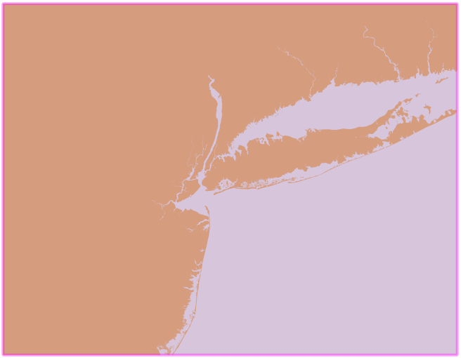

### LandmassNYCWet

LandmassNYCWet is the New York City landmass with interior hydrography (lakes and ponds)
removed. It's a fully dissolved landmass with no polygon boundaries at political
jurisdiction boundaries like boroughs.  There are no multipart polygons, each 
polygon is a single outer ring.

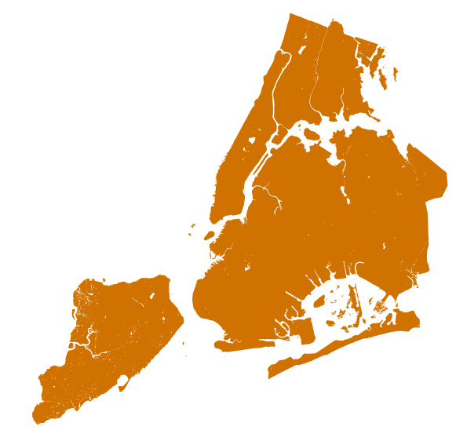

### LandmassNYCDry

LandmassNYCDry is LandmassNYCWet with interior hydrogaphy rings (holes) removed
to create a continous landmass surrounded by salt water.

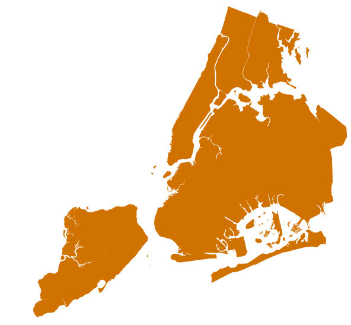

### LandmassFringe

LandmassFringe is a dissolved landmass for land outside of New York City.  It
is spatially dissolved with no political boundaries. Each polygon is a single
outer ring, there are no multipart polygons. The level of detail is 
similar to the planimetrics data captured within New York City.

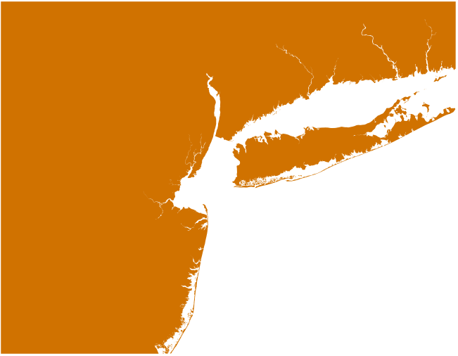

### LandmassPangaeaWet

LandmassPangaeaWet is LandmassFringe unioned with LandmassNYCWet and processed 
into a single ginormous object. All polygons and interior hydro is represented
as one multipolygon with many interior rings.

Why flagellate ourselves with such a geometric shape?  It's useful when creating
fancy hydro shading in water.

The image extent below is zoomed in a bit to try to show interior hydro.

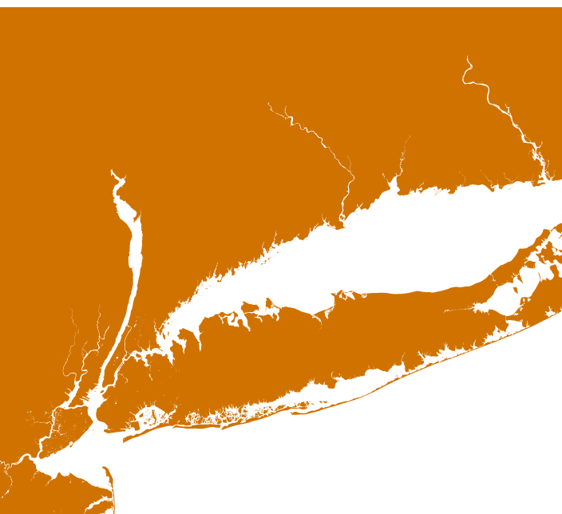

### LandmassPangaeaDry

LandmassPangaeaDry is LandmassPangaeaWet with interior hydro rings removed.  
This means that though it is still a single ginormous multipolygon it has
no interior rings.

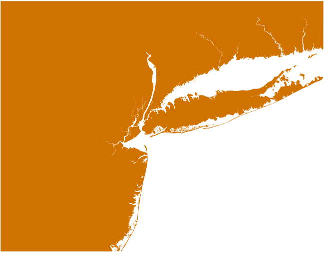

### LandmassRiftedWet

LandmassRiftedWet is an exploded version of LandmassPangaeaWet.  Instead of a 
single object each exterior ring gets its own object with interior rings
for each object as needed.

The image extent below is zoomed in a bit to try to show interior hydro and 
one of the rings is highlighted.

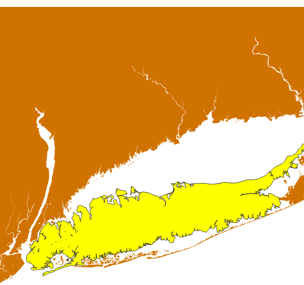

### LandmassRiftedDry

LandmassRiftedDry is an exploded version of LandmassPangaeaDry with a single 
object for each exterior ring. 

The image extent below is zoomed in a little and one of the rings is highlighted.

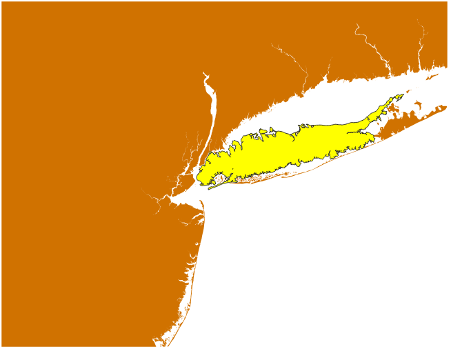


## How To Create

The steps below are a rough guide and a process like this inevitably includes
a lot of trial and error.  But don't worry friends, it's our process, our rules,
the trick is to never be afraid.

### Hand-Wavy Creation Steps: NYC 

1. Generate a buffered polygon for each borough.  We did this by hand, don't 
worry, drawing is fun and it only takes a few minutes.

2. Extend each borough blob into into the water without touching another NYC 
borough.

3. However do extend Bronx and Queens a little into Westchester and Nassau

   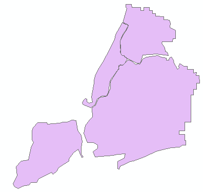

4. Subtract all-water planimetrics [hydrography](https://github.com/CityOfNewYork/nyc-planimetrics/blob/master/Capture_Rules.md#hydrography) 
(feature_code <> 2640 and feature_code <> 2650)

    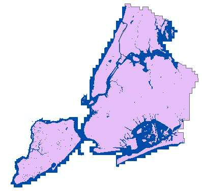

5. Subtract Westchester County (use Census Bureau TIGER line full resolution)

6. Subtract Nassau County (use Census Bureau TIGER line full resolution)

```Stash this step 6 dataset away, we'll pick it up at step 9```

7. Add planimetrics [hydro_structure](https://github.com/CityOfNewYork/nyc-planimetrics/blob/master/Capture_Rules.md#hydro-structure). 
Add floating piers, etc, but don't add overlapping structures on piers, 
sub_feature_code 280040.  Don't add structures that are on the New Jersey and
Nassau County Coasts.

8. Explode multipolygons into individual records.

```This is LandmassNYCWet```

9. Starting with the stashed dataset from step 6, remove interior rings.  This 
step must be completed before the addition of hydro structures to distinguish
lakes from enclosed piers and the like.

    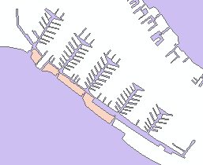

10. Now add planimetrics [hydro_structure](https://github.com/CityOfNewYork/nyc-planimetrics/blob/master/Capture_Rules.md#hydro-structure). 
Add floating piers, etc, but don't add overlapping structures on piers, 
sub_feature_code 280040.  Don't add structures that are on the New Jersey and
Nassau County Coasts.

11. Explode multipolygons into indvividual records.

```This is LandmassNYCDry```

### Hand-Wavy Creation Steps: Fringe Business

1. Take selected coastal counties in New York, New Jersey, and Connecticut from
TIGER line.

2. (SECRET EXECUTIVE DECISION 1) Manually clip back the section of New Jersey 
that overlaps Shooter's Island off the north shore of Staten Island

3. (SECRET EXECUTIVE DECISION 2) Manually remove the section of New Jersey that
includes Ellis and Liberty Island.

4. Subtract TIGER line AREAWATER polygons.  This will create both the coastline
and interior hydro like lakes and ponds.

    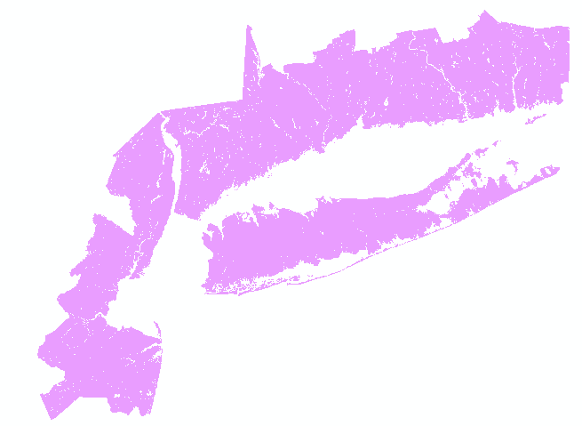

5. Remove interior hydro rings.  This can't be done for each county since chains
of hydro may cross counties all the way to the coast.

6. Explode multipolygons into single outer ring polygons.

7. Add additional interior land for counties that don't touch the coast, 
extending all the way to the LandmassExtent boundary.

8. Union polygons that have a spatial interaction.

9. Remove any new interior rings between unioned shapes. 

10. Explode all output shapes.

```This is LandmassFringe```

### Hand-Wavy Creation Steps: Full Extent Datasets

1. Copy LandmassNYCWet to a working layer

2. Union the LandmassNYCWet shapes with LandmassFringe, spatially unioning 
related records and passing through disjoint bits.

3. Dissolve any new internal boundaries

4. (optional) Simplify the shapes to remove coordinates.  In our case this step 
was motivated by a limitation in Oracle Spatial on the total number of ordinates,
around one million (ie 500,000 vertices) allowed in a single sdo_ordinate_array.

5. (optional) Dissolve again for polygons with new spatial interactions after
simplification.

6. Append all records into a single pangaea multipolygon.

```This is LandmassPangaeaWet```

7. Remove interior rings

```This is LandmassPangaeaDry```

8. Explode step 6 LandmassPangaeaWet into multiple rings

```This is LandmassRiftedWet```

9. Eplode step 7 LandmassPangaeaDry

```This is LandmassRiftedDry```

From all of us at NYC_Landmass thank you for being you.


